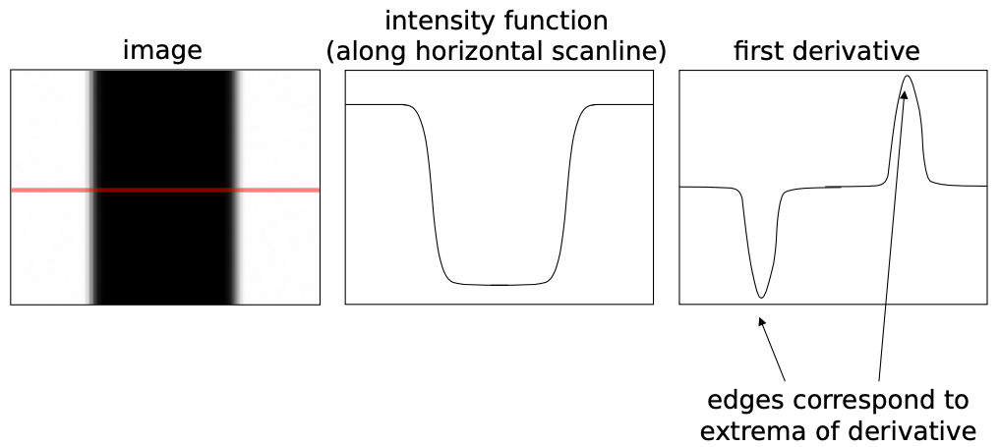
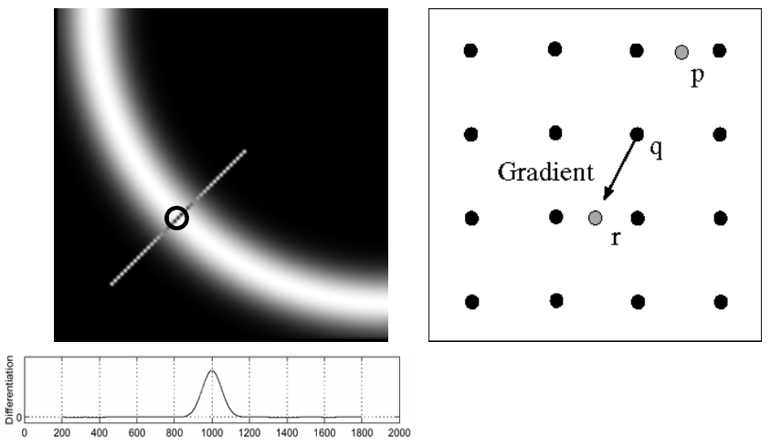
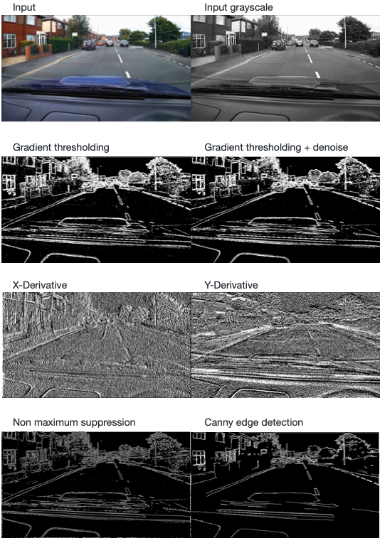

# Edge Extraction

* In computer science, images are 2D arrays:
> width x height (grayscale)

> width x height for (3 color values)

* In mathematics, they are functions sampled on a 2D-grid:
> f(x,y): R2 → R (grayscale)

> f(x,y): R2 → R3 (3 color values)

## Filtering:
It aims to form new images whose pixels are a combination of the original pixels in order to either get useful information (ex: extract edges to understand shapes, ...) or to enhance the images (ex: remove noise, ...). 

## Edge detection:
The goal of edge detection is to identify sudden changes or discontinuities in an image, as these areas carry important semantic and shape information. For example, it is interesting to note that even a three-year-old child has no difficulty in recognizing and describing familiar objects based only on their ege lines.
Thus, edge detection is a means of extracting information and recognizing objects more easily. In addition, keeping only the edges of an image is also a way to make it more compact.

#### How can we characterize edges in an image?
An edge occurs when the color and hence the intensity of the image changes rapidly. However, segmenting an image into colored regions is very difficult and it is often better to detect edges using only purely local information. Thus, a good approach is to define an edge as a place of rapid change in the image intensity. As we said earlier, images can be considered as mathematical functions sampled on a 2D-grid and therefore the locations of steep slopes correspond to the locations of edges.

To define the slope and direction of steepest ascent in the intensity function we use its gradient: `J(x) = ∇I(x) = (∂I/∂x, ∂I/∂y)(x)`
Its magnitude indicates the slope of the intensity variation, while its orientation indicates the perpendicular direction to the local contour.

## Canny edge detection:

#### Gradient and derivatives, Sobel denoising
Canny edge detection is an image processing method used to detect a wide range of edges in an image while suppressing noise. Here we first convert the image into grayscale. Unig a Sobel operator we compute an approximation of the gradient:

The magnitude and the orientation angle of the gradient will be used for non maximum suppresion. 

#### Non maximim suppression
The result of the filter is an image with thick edges but ideally one would like to get thin edges. Thus, we must perform non maximum suppression to thin out the edges. Non maximum suppression works by finding the pixel with the maximum value in an edge. When a pixel has a higher intensity than its two neighbors in the gradient direction, then we set the pixel to 255 (white), otherwise we set it to 0 (black).

#### Double thresholding
After this step, the result is still not perfect: some edges may not really be edges and there is noise in the image. This is why we use double thresholding. We set two thresholds, a high threshold and a low threshold. Pixels with a high value (higher than the high threshold) and therefore more likely to be strong edges will be set to 255. Pixels with a value below the low threshold do not contribute to an edge and are set to 0. Pixels whose value is between the low and high threshold are weak edges, in other words, we do not know if they are really edges.

Now that we have determined the positions of the strong and weak edges, we need to determine which of the weak edges are true edges. We can assume that the weak edges that are connected to the strong edges will be real edges. In contrast, weak edges that are not connected to the strong edges will not be real edges and will be set to 0. 

#### Results

